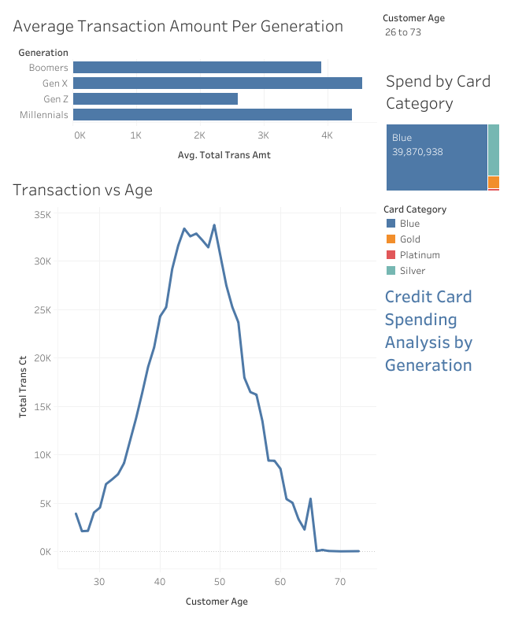

# Credit Card Spending by Generation – Tableau Dashboard

This project explores how different generations spend on their credit cards. I used Tableau to build an interactive dashboard that highlights spending habits, transaction volume, and card preferences based on age groups.

What the Dashboard Shows:
- Which generation spends the most on average
- How transaction count changes with age
- What card types are used most frequently
- The ability to filter everything by generation

Tools Used:
- Tableau Public 
- Excel 
- Dataset: https://www.kaggle.com/datasets/sakshigoyal7/credit-card-customers

Live Dashboard:
Paste your Tableau Public link here

Dashboard Preview:

